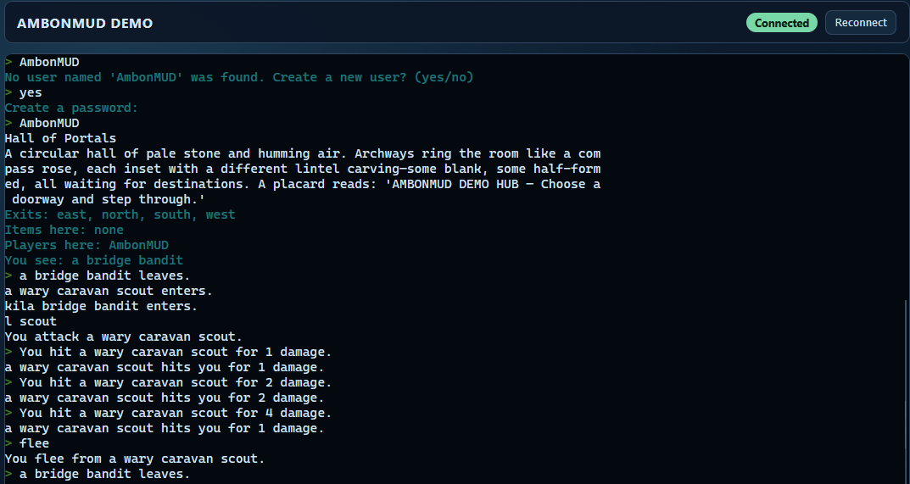

AmbonMUD
========

**AmbonMUD** is a production-grade **Kotlin MUD server** with a tick-based event loop, dual transports (telnet + WebSocket), YAML-defined multi-zone worlds, class-based character progression, 102 class-specific spells/abilities, dynamic status effects, real-time combat with NPCs, shops/economy, and three deployment modes (STANDALONE, ENGINE, GATEWAY) for horizontal scaling.

**Key Features**
- 🎮 **4 playable classes** (Warrior, Mage, Cleric, Rogue) with **25+ unique abilities** per class, distributed across 50 levels
- 🌍 **8 YAML-defined zones** with multi-zone support, cross-zone exits, and zone instancing for load distribution
- ⚔️ **Real-time combat system** with attribute-based damage, dodge mechanics, and tactical status effects (DoT, HoT, STUN, ROOT, SHIELD, buffs/debuffs)
- 💰 **Economy system**: gold drops, item pricing, shops, `buy`/`sell` commands
- 🔌 **Dual transports**: telnet (NAWS/TTYPE/GMCP negotiation) + browser WebSocket with GMCP-aware UI panels
- 📊 **Structured data** (GMCP) for client-side telemetry and advanced UI features
- 💾 **Flexible persistence**: YAML (default) or PostgreSQL with optional Redis L2 caching
- 🌐 **Three deployment modes**: STANDALONE (single-process), ENGINE (game logic + gRPC), GATEWAY (transports + gRPC) for horizontal scaling
- 🗺️ **Zone-based sharding** with inter-engine messaging, player handoff, and O(1) cross-engine `tell` routing
- 📈 **Prometheus metrics** for monitoring and load testing integration
- ✅ **~78 test files** covering all systems; CI validates against Java 21 with ktlint

**Current State** (Feb 2026)
- ✅ All 5 scalability phases complete (bus abstraction, async persistence, Redis, gRPC gateway, zone sharding)
- ✅ 102 abilities across 4 classes (newly expanded this session)
- ✅ GMCP support with 13 data packages
- ✅ Quest system (basic implementation; see [roadmap](docs/ROADMAP.md))
- ✅ Achievement system, group/party system, dialogue trees, NPC behavior trees
- ✅ Full production test coverage and CI/CD

Screenshots
-----------
Web client:



## Quick Start

**Requirements:** JDK 21, Gradle wrapper (included in repo)

**Start the server:**
```bash
./gradlew run          # Unix
.\gradlew.bat run      # Windows
```

**Launch browser demo:**
```bash
./gradlew demo         # Auto-opens http://localhost:8080
```

**Connect via telnet:**
```bash
telnet localhost 4000  # Telnet client
```

By default: telnet on **:4000**, web on **:8080** (configurable in `src/main/resources/application.yaml`).

> **Note:** Web client loads xterm.js from CDN. For offline use, prefer telnet.

## Configuration & Deployment

**Runtime config** is loaded from `src/main/resources/application.yaml`. Override any value at startup:

```bash
./gradlew run -Pconfig.ambonMUD.server.telnetPort=5000
./gradlew run -Pconfig.ambonMUD.persistence.backend=POSTGRES
./gradlew run -Pconfig.ambonMUD.logging.level=DEBUG
```

See [DEVELOPER_GUIDE.md](docs/DEVELOPER_GUIDE.md#configuration) for detailed configuration options and multi-instance setup.

**Deployment Modes:**
- **STANDALONE** (default): Single-process, all components in-memory
- **ENGINE**: Game logic + persistence + gRPC server for remote gateways
- **GATEWAY**: Transports (telnet/WebSocket) + gRPC client to a remote engine

See [ARCHITECTURE.md](docs/ARCHITECTURE.md) for architectural details and [DEVELOPER_GUIDE.md](docs/DEVELOPER_GUIDE.md#deployment-modes) for setup instructions.

## Gameplay

**Character Creation**
- Name: 2-16 chars (alnum/underscore, cannot start with digit)
- Password: 1-72 chars (bcrypt hashed)
- Race: Human, Elf, Dwarf, Halfling (each has attribute modifiers)
- Class: Warrior, Mage, Cleric, Rogue (each with 25+ class-specific abilities)

**Core Commands**
- **Movement:** `n`/`s`/`e`/`w`/`u`/`d`, `look`, `exits`
- **Combat:** `kill <mob>`, `flee`, `cast <spell>`, `spells`, `effects`
- **Items:** `inventory`, `equipment`, `get`, `drop`, `wear`, `remove`, `use`, `give`
- **Communication:** `say`, `tell`, `gossip`, `whisper`, `shout`, `emote`, `ooc`, `pose`
- **Character:** `score`, `gold`, `help`, `who`, `quit`
- **Economy:** `buy`, `sell`, `list` (in shops)
- **Zones:** `phase` (switch zone instances)
- **Admin:** `goto`, `transfer`, `spawn`, `smite`, `kick`, `shutdown` (requires staff flag)

See [DEVELOPER_GUIDE.md](docs/DEVELOPER_GUIDE.md#gameplay-reference) for full command list and details.

**Abilities & Combat**
- **102 total abilities** distributed across 4 classes (25+ per class, levels 1–50)
- **Status effects:** DoT, HoT, STAT_BUFF/DEBUFF, STUN, ROOT, SHIELD with configurable stacking
- **Attributes:** STR (melee damage), DEX (dodge), CON (HP regen), INT (spell damage), WIS (mana regen), CHA
- **Real-time combat** with attribute-based damage scaling, dodge mechanics, and tactical depth

## World Content

**World files** live in `src/main/resources/world/` and are loaded by `WorldLoader`. Each YAML file describes one zone; multiple zones are merged into a single world.

**Current Zones (8 regions):**
| Zone | Description |
|------|-------------|
| `tutorial_glade` | Starting area for new players |
| `ambon_hub` | Central hub connecting all zones |
| `noecker_resume` | Resume showcase zone |
| `demo_ruins` | Ancient ruins with varied content |
| `low_training_marsh` | Low-level training zone (marsh) |
| `low_training_highlands` | Low-level training zone (highlands) |
| `low_training_mines` | Low-level training zone (mines) |
| `low_training_barrens` | Low-level training zone (barrens) |

**Zone YAML Format**
```yaml
zone: demo_zone
startRoom: entrance
rooms:
  entrance:
    title: "Forest Entrance"
    description: "You stand at the edge of a vast forest."
    exits:
      north: clearing
mobs:
  wolf:
    name: "a wary wolf"
    room: entrance
    respawnSeconds: 60
items:
  potion:
    displayName: "a healing potion"
    consumable: true
    onUse:
      healHp: 20
shops:
  general_store:
    room: entrance
    keeperName: "the merchant"
```

See [WORLD_YAML_SPEC.md](docs/WORLD_YAML_SPEC.md) for full schema documentation (rooms, mobs, items, shops, behaviors, dialogues).

## Testing & Build

**Run tests:**
```bash
./gradlew test                    # Full test suite
./gradlew test --tests "ClassName"  # Single test class
```

**Lint (Kotlin style):**
```bash
./gradlew ktlintCheck
```

**CI parity check** (recommended before finalizing):
```bash
./gradlew ktlintCheck test
```

## Persistence

**Backends** (selectable via `ambonMUD.persistence.backend`):
- **YAML** (default): Player files in `data/players/`, no external infrastructure
- **PostgreSQL**: Database-backed (schema via Flyway migrations V1–V7)

Both backends support optional **Redis L2 caching** (`ambonMUD.redis.enabled=true`) for distributed deployments.

**Grant staff access:**
- YAML: Add `isStaff: true` to player YAML file
- PostgreSQL: Set `is_staff = true` in the `players` table

See [DEVELOPER_GUIDE.md](docs/DEVELOPER_GUIDE.md#persistence) for detailed persistence setup.

## Infrastructure & Deployment

**Docker Compose** (brings up all optional services):
```bash
docker compose up -d
```

Includes: Prometheus (metrics), Grafana (dashboards), Redis (caching/pub-sub), PostgreSQL (persistence).

**Run with PostgreSQL backend:**
```bash
./gradlew run -Pconfig.ambonMUD.persistence.backend=POSTGRES
```

**Run with Redis caching:**
```bash
./gradlew run -Pconfig.ambonMUD.redis.enabled=true
```

**Access Grafana:** `http://localhost:3000` (admin/admin)

See [DEVELOPER_GUIDE.md](docs/DEVELOPER_GUIDE.md#infrastructure) for detailed setup.

## Architecture & Development

**Scalability** has 5 complete phases:
1. Event bus abstraction (InboundBus/OutboundBus, SessionIdFactory)
2. Async persistence worker (write-behind coalescing)
3. Redis integration (L2 cache + pub/sub)
4. gRPC gateway split (multi-gateway horizontal scaling)
5. Zone-based engine sharding (multi-engine with zone instancing)

**Architecture & Design**
- [ARCHITECTURE.md](docs/ARCHITECTURE.md) — Architectural principles and design decisions
- [docs/engine-sharding-design.md](docs/engine-sharding-design.md) — Zone-based sharding technical design
- [docs/WORLD_YAML_SPEC.md](docs/WORLD_YAML_SPEC.md) — Zone YAML format specification

**Developer Resources**
- [DEVELOPER_GUIDE.md](docs/DEVELOPER_GUIDE.md) — Complete onboarding from zero to productive
- [docs/ROADMAP.md](docs/ROADMAP.md) — Planned features and future work
- [CLAUDE.md](CLAUDE.md) — Internal development directives for Claude Code
- [AGENTS.md](AGENTS.md) — Engineering playbook for code changes

## Load Testing

The `swarm/` module provides Kotlin-based bot-driven load testing:

```bash
./gradlew :swarm:run --args="--config example.swarm.yaml"
```

See [swarm/README.md](swarm/README.md) for configuration.

## Contributing

To contribute, see [DEVELOPER_GUIDE.md](docs/DEVELOPER_GUIDE.md#contributing) for workflow and [CLAUDE.md](CLAUDE.md) for architectural contracts and change playbooks.

Questions? Open an issue or see the documentation above.
