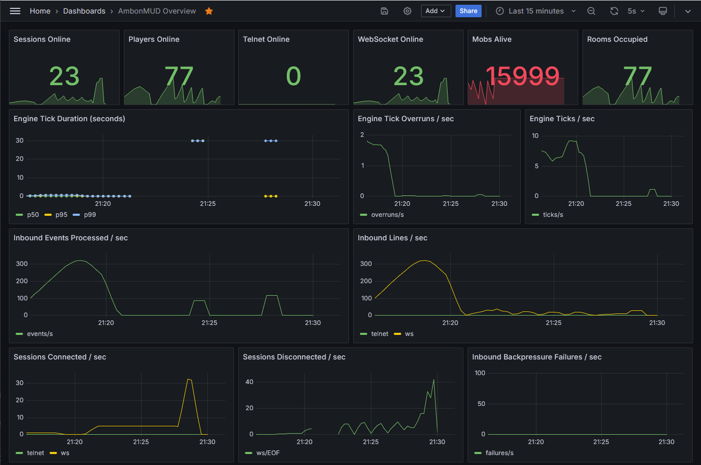
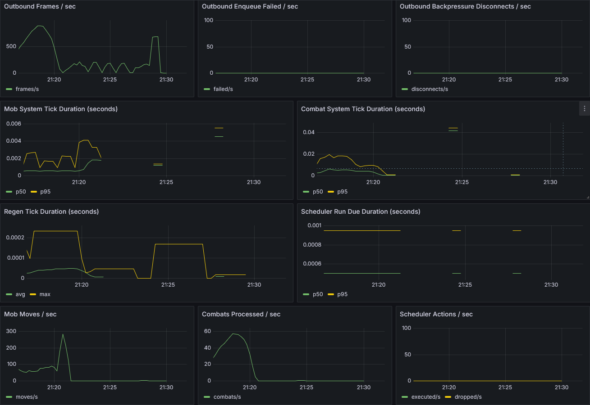

AmbonMUD
========

AmbonMUD is a Kotlin MUD server (runtime banner: "AmbonMUD"). It is a production-quality, event-driven backend with telnet and WebSocket transports, data-driven world loading, tiered NPC combat, and a layered persistence stack with selectable YAML or PostgreSQL backends and optional Redis caching.

Current State
-------------
- Tick-based engine with NPC wandering and scheduled actions.
- Three deployment modes: `STANDALONE` (single-process, default), `ENGINE` (game logic + gRPC server), `GATEWAY` (transports + gRPC client) for horizontal scaling.
- Dual transport support: native telnet and a browser WebSocket client (xterm.js; served by the server at `/` and `/ws`).
- Login flow with name + password (bcrypt), per-session state, and layered persistence (write-behind coalescing + optional Redis L2 cache).
- YAML-defined, multi-zone world with validation on load (optional zone `lifespan` resets to respawn mobs/items).
- Items and mobs loaded from world data; items can be in rooms or on mobs; inventory and equipment supported.
- Wearable items support basic `damage`, `armor`, and `constitution` stats with slots (head/body/hand).
- Tiered NPC system (weak/standard/elite/boss) with per-mob stat overrides, XP rewards, and loot tables.
- Combat with `kill <mob>` and `flee`, resolved over ticks (kills grant XP; players can level up).
- HP regeneration over time (regen interval scales with constitution + equipment).
- Chat and social commands (say, emote, tell, gossip), plus basic UI helpers (ANSI, clear, colors).
- Staff/admin commands (goto, transfer, spawn, smite, kick, shutdown) gated behind `isStaff` flag.
- Abstracted `InboundBus` / `OutboundBus` interfaces with Local, Redis, and gRPC implementations.
- Optional Redis integration: L2 player cache + pub/sub event bus (disabled by default).
- gRPC bidirectional streaming for gateway-to-engine communication with exponential-backoff reconnect.
- Snowflake-style session IDs for globally unique allocation across gateways, with overflow wait and clock-rollback hardening.
- Prometheus metrics endpoint (served by Ktor in `STANDALONE` / `GATEWAY` mode; standalone HTTP server in `ENGINE` mode).

Screenshots
-----------
Web client:


Requirements
------------
- JDK 17
- Gradle wrapper (included)

Run
---
1) Start the server:

```bash
./gradlew run
```

On Windows:

```powershell
.\gradlew.bat run
```

Or launch demo mode (auto-opens browser when supported):

```bash
./gradlew demo
```

On Windows:

```powershell
.\gradlew.bat demo
```

`demo` enables browser auto-launch by setting:

```text
config.override.ambonMUD.demo.autoLaunchBrowser=true
```

2) Connect with telnet:

```bash
telnet localhost 4000
```

3) Open the browser demo client:

```text
http://localhost:8080
```

By default the server listens on telnet port 4000 and web port 8080. These values come from `src/main/resources/application.yaml`.

Note: The web client loads xterm.js from a CDN. If you're offline, prefer telnet.

Configuration
-------------
Runtime config is loaded via Hoplite from `src/main/resources/application.yaml`.

Top-level key:

```yaml
ambonMUD:
  ...
```

Any config value can be overridden at runtime with a `-P` project property using the pattern `-Pconfig.<key>=<value>`:

```bash
./gradlew run -Pconfig.ambonMUD.server.telnetPort=5000
./gradlew run -Pconfig.ambonMUD.logging.level=DEBUG
./gradlew run -Pconfig.ambonMUD.logging.packageLevels.dev.ambon.transport=DEBUG
```

This works identically on Windows PowerShell with no quoting issues.

Most day-to-day tuning lives under:
- `ambonMUD.server` (ports, tick rates, channel capacities)
- `ambonMUD.world.resources` (which zone YAML resources to load)
- `ambonMUD.persistence.backend` (`YAML` or `POSTGRES` — default `YAML`)
- `ambonMUD.persistence.rootDir` (where player YAML data is written, YAML backend only)
- `ambonMUD.persistence.worker` (write-behind flush interval, enable/disable)
- `ambonMUD.database` (jdbcUrl, username, password, pool size — defaults match docker compose)
- `ambonMUD.redis` (enabled, URI, cache TTL, pub/sub bus config)
- `ambonMUD.logging` (root log level and per-package overrides)

Login
-----
On connect, you will be prompted for a character name and password.
- Name rules: 2-16 characters, letters/digits/underscore, cannot start with a digit.
- Password rules: 1-72 characters.
- Existing characters require the correct password.
- Login banner text is loaded from `src/main/resources/login.txt`.
- Optional login banner styles are loaded from `src/main/resources/login.styles.yaml`.
- If the styles file is missing or invalid, the banner is shown without ANSI styling.

Commands
--------
**Movement / Look**
- `n`, `s`, `e`, `w`, `u`, `d` (or `north`, `south`, `east`, `west`, `up`, `down`): move.
- `look` or `l`: look around the current room.
- `look <direction>`: peek into a direction (e.g. `look north`).
- `exits` or `ex`: list exits in the current room.

**Communication**
- `say <msg>` or `'<msg>`: speak to the room.
- `emote <msg>`: perform an emote visible to the room.
- `who`: list online players.
- `tell <player> <msg>` or `t <player> <msg>`: private message.
- `gossip <msg>` or `gs <msg>`: broadcast to everyone.

**Items**
- `inventory` / `inv` / `i`: show inventory.
- `equipment` / `eq`: show worn items.
- `wear <item>` / `equip <item>`: wear an item from inventory.
- `remove <slot>` / `unequip <slot>`: remove an item from a slot (`head`, `body`, `hand`).
- `get <item>` / `take <item>` / `pickup <item>` / `pick <item>` / `pick up <item>`: take item.
- `drop <item>`: drop item.

**Combat**
- `kill <mob>`: engage a mob in combat.
- `flee`: end combat (you stay in the room).

**Character**
- `score` or `sc`: show character sheet (level, HP, XP, constitution, equipment stats).

**UI / Settings**
- `ansi on` / `ansi off`: toggle ANSI colors.
- `colors`: show ANSI demo (when ANSI is on).
- `clear`: clear screen (ANSI) or print a divider.
- `help` or `?`: list available commands.
- `quit` or `exit`: disconnect.

**Staff / Admin** *(requires `isStaff: true` on the player record)*
- `goto <room>`: teleport to a room (`zone:room`, bare `room` for current zone, `zone:` for zone start).
- `transfer <player> <room>`: move a player to a room.
- `spawn <mob-template>`: spawn a mob by template ID.
- `smite <player|mob>`: instantly kill a player or mob.
- `kick <player>`: disconnect a player.
- `shutdown`: gracefully shut down the server.

World Data
----------
World files live in `src/main/resources/world` and are loaded by `dev.ambon.domain.world.WorldFactory`. Each YAML file describes a zone; multiple zones are merged into a single world.

Detailed format/validation rules for generators are documented in `docs/world-zone-yaml-spec.md`.

```yaml
zone: demo
startRoom: trailhead
mobs:
  wolf:
    name: "a wary wolf"
    room: trailhead
items:
  lantern:
    displayName: "a brass lantern"
    description: "A brass lantern with soot-stained glass."
    room: trailhead
rooms:
  trailhead:
    title: "Forest Trailhead"
    description: "A narrow trail slips beneath ancient boughs."
    exits:
      north: mossy_path
```

Notes:
- Room IDs and exit targets can be local (`trailhead`) or fully qualified (`zone:trailhead`).
- `mobs` and `items` are optional; `rooms` and `startRoom` are required.
- Items may be placed in a `room` or on a `mob` (not both).
- Items may define `slot` (`head`, `body`, `hand`) and optional `damage`/`armor`/`constitution` stats.
- Exit directions support `north/south/east/west/up/down` in world files.
- Optional `lifespan` is in minutes; zones with `lifespan > 0` periodically reset mob/item spawns at runtime.

Persistence
-----------
AmbonMUD supports two player persistence backends, selected via `ambonMUD.persistence.backend`:

| Backend | Description |
|---------|-------------|
| `YAML` (default) | Player records stored as YAML files under `data/players/`. No external infrastructure needed. |
| `POSTGRES` | Player records stored in a PostgreSQL database. Schema managed by Flyway migrations. |

The persistence stack has three layers regardless of backend:

```
WriteCoalescingPlayerRepository  ← dirty-flag write-behind (configurable flush interval)
  ↓
RedisCachingPlayerRepository     ← L2 cache (if redis.enabled = true)
  ↓
YamlPlayerRepository             ← durable YAML files, atomic writes
  — or —
PostgresPlayerRepository         ← Exposed DSL + HikariCP connection pool
```

### YAML Backend (default)

No additional configuration needed. Player files are written to `data/players/players/` (configurable via `ambonMUD.persistence.rootDir`). IDs are allocated in `data/players/next_player_id.txt`.

### PostgreSQL Backend

Requires a running PostgreSQL instance. The database connection defaults (`localhost:5432/ambonmud`, user `ambon`, password `ambon`) match the docker compose stack, so you only need to flip the backend flag:

```bash
./gradlew run -Pconfig.ambonMUD.persistence.backend=POSTGRES
```

Or in `application.yaml`:

```yaml
ambonMUD:
  persistence:
    backend: POSTGRES
```

To connect to a different Postgres instance, override the `database.*` keys:

```bash
./gradlew run -Pconfig.ambonMUD.persistence.backend=POSTGRES \
              -Pconfig.ambonMUD.database.jdbcUrl=jdbc:postgresql://myhost:5432/mydb \
              -Pconfig.ambonMUD.database.username=myuser \
              -Pconfig.ambonMUD.database.password=mypass
```

Flyway runs migrations automatically on startup. Schema files live in `src/main/resources/db/migration/`.

### Redis Caching (optional, works with either backend)

Redis caching is disabled by default. The connection URI defaults to `redis://localhost:6379` (matching docker compose), so just flip the flag:

```bash
./gradlew run -Pconfig.ambonMUD.redis.enabled=true
```

### Staff Access

To grant staff/admin access to a player:
- **YAML backend:** add `isStaff: true` to their record at `data/players/players/<id>.yaml`
- **Postgres backend:** set `is_staff = true` on their row in the `players` table

Tests
-----
```bash
./gradlew test
```

Formatting / Lint
-----------------
```bash
./gradlew ktlintCheck
```

Docker Compose (Full Infrastructure)
-------------------------------------
The `docker-compose.yml` brings up all optional infrastructure in one command:

| Service | Image | Port | Purpose |
|---------|-------|------|---------|
| Prometheus | `prom/prometheus:v2.51.2` | 9090 | Metrics scraping |
| Grafana | `grafana/grafana:10.4.2` | 3000 | Dashboards |
| Redis | `redis:7-alpine` | 6379 | L2 player cache + pub/sub event bus |
| PostgreSQL | `postgres:16-alpine` | 5432 | Player persistence (alternative to YAML) |

1) Start the stack:

```bash
docker compose up -d
```

2) Run with the PostgreSQL backend (connection defaults already match the compose stack):

```bash
./gradlew run -Pconfig.ambonMUD.persistence.backend=POSTGRES
```

Flyway runs migrations automatically on first startup — no manual schema setup needed.

3) Run with Redis caching enabled:

```bash
./gradlew run -Pconfig.ambonMUD.redis.enabled=true
```

4) Open Grafana:

```text
http://localhost:3000
```

Login:
- Username: `admin`
- Password: `admin`

Data is persisted in a Docker named volume (`pgdata`). To wipe the database and start fresh, run `docker compose down -v`.

Grafana dashboards during load testing:




Scalability Roadmap
-------------------
The codebase follows a four-phase scalability plan. Phases 1–4 are implemented:

| Phase | Description | Status |
|-------|-------------|--------|
| 1 | Abstract `InboundBus`/`OutboundBus` interfaces; extract `SessionIdFactory` | ✅ Done |
| 2 | Async persistence worker with write-behind coalescing | ✅ Done |
| 3 | Redis L2 player cache + pub/sub event bus | ✅ Done |
| 4 | gRPC gateway split for true horizontal scaling | ✅ Done |

See `docs/scalability-plan-brainstorm.md` for detailed design and `DesignDecisions.md` for rationale.

Design Notes
------------
See `DesignDecisions.md` for architectural rationale and future-direction notes.
