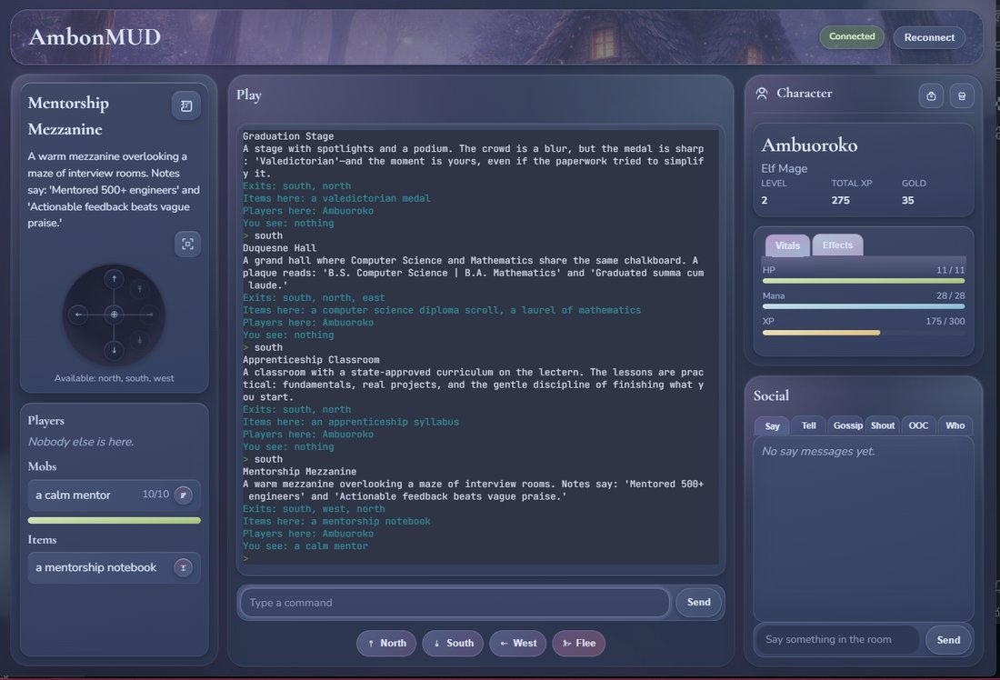

AmbonMUD
========

**AmbonMUD** is a production-grade **Kotlin MUD server** with a tick-based event loop, dual transports (telnet + WebSocket), YAML-defined multi-zone worlds, class-based character progression, 56 class-specific spells/abilities, dynamic status effects, real-time combat with NPCs, shops/economy, and three deployment modes (STANDALONE, ENGINE, GATEWAY) for horizontal scaling.

**Live demo:** [https://mud.ambon.dev](https://mud.ambon.dev) — or `telnet mud.ambon.dev 4000`

**Key Features**
- 🎮 **4 playable classes** (Warrior, Mage, Cleric, Rogue) with **56 abilities** across all classes, distributed across 50 levels
- 🌍 **13 YAML-defined zones** with multi-zone support, cross-zone exits, and zone instancing for load distribution
- ⚔️ **Real-time combat system** with attribute-based damage, dodge mechanics, and tactical status effects (DoT, HoT, STUN, ROOT, SHIELD, buffs/debuffs)
- 💰 **Economy system**: gold drops, item pricing, shops, `buy`/`sell` commands
- 🔌 **Dual transports**: telnet (NAWS/TTYPE/GMCP negotiation) + browser WebSocket with GMCP-aware UI panels
- 📊 **Structured data** (GMCP) — 25 packages over telnet and WebSocket; see [GMCP_PROTOCOL.md](docs/GMCP_PROTOCOL.md)
- 💾 **Flexible persistence**: YAML files by default (zero-dependency), PostgreSQL with optional Redis L2 caching available
- 🌐 **Three deployment modes**: STANDALONE (single-process), ENGINE (game logic + gRPC), GATEWAY (transports + gRPC) for horizontal scaling
- 🗺️ **Zone-based sharding** with inter-engine messaging, player handoff, and O(1) cross-engine `tell` routing
- 🧵 **JVM virtual threads** for telnet I/O (JDK 21) — eliminates carrier-thread pinning under load
- 📈 **Prometheus metrics** for monitoring and load testing integration
- ✅ **~110 test files** covering all systems; CI validates against Java 21 with ktlint

**Current State** (Mar 2026)
- ✅ All 6 scalability phases complete (bus abstraction, async persistence, Redis, gRPC gateway, zone sharding, production AWS infrastructure)
- ✅ 56 abilities across 4 classes (levels 1–50)
- ✅ GMCP support with 25 outbound packages (telnet + WebSocket); see [GMCP_PROTOCOL.md](docs/GMCP_PROTOCOL.md)
- ✅ Quest system (basic implementation; see [roadmap](docs/ROADMAP.md))
- ✅ Achievement system, group/party system, dialogue trees, NPC behavior trees
- ✅ Guild system with hierarchy, guild chat, MOTD
- ✅ Friends list and in-game mail system
- ✅ Crafting and gathering system
- ✅ Full production test coverage and CI/CD
- ✅ Docker image + AWS CDK infrastructure: EC2 demo (~$4-5/mo) and ECS Fargate (topology × tier) options
- ✅ Live demo at [mud.ambon.dev](https://mud.ambon.dev) — auto-deploys on every push to `main`

Screenshots
-----------
Current web client (v3):



See [docs/WEB_CLIENT.md](docs/WEB_CLIENT.md#visual-progression) for the full progression from telnet proof-of-concept to the current UI.

## Quick Start

**Requirements:** JDK 21, Gradle wrapper (included in repo)

**Start the server** (YAML persistence, no external services needed):
```bash
./gradlew run          # Unix
.\gradlew.bat run      # Windows
```

**Launch browser demo:**
```bash
./gradlew demo         # Auto-opens http://localhost:8080
```

**Connect via telnet:**
```bash
telnet localhost 4000
```

By default: telnet on **:4000**, web on **:8080** (configurable in `src/main/resources/application.yaml`).

**To use PostgreSQL + Redis locally**, bring up the Docker Compose stack first:
```bash
docker compose up -d
./gradlew run -Pconfig.ambonmud.persistence.backend=POSTGRES -Pconfig.ambonmud.redis.enabled=true
```

> **Note:** Web client loads xterm.js from CDN. For offline use, prefer telnet.

## Configuration & Deployment

**Runtime config** is loaded from `src/main/resources/application.yaml`. Override any value at startup:

```bash
./gradlew run -Pconfig.ambonmud.server.telnetPort=5000
./gradlew run -Pconfig.ambonmud.persistence.backend=YAML
./gradlew run -Pconfig.ambonmud.redis.enabled=false
./gradlew run -Pconfig.ambonmud.logging.level=DEBUG
```

See [DEVELOPER_GUIDE.md](docs/DEVELOPER_GUIDE.md#configuration) for detailed configuration options and multi-instance setup.

**Deployment Modes:**
- **STANDALONE** (default): Single-process app using localhost Postgres/Redis by default
- **ENGINE**: Game logic + persistence + gRPC server for remote gateways
- **GATEWAY**: Transports (telnet/WebSocket) + gRPC client to a remote engine

See [ARCHITECTURE.md](docs/ARCHITECTURE.md) for architectural details and [DEVELOPER_GUIDE.md](docs/DEVELOPER_GUIDE.md#deployment-modes) for setup instructions.

## Gameplay

**Character Creation**
- Name: 2-16 chars (alnum/underscore, cannot start with digit)
- Password: 1-72 chars (bcrypt hashed)
- Race: Human, Elf, Dwarf, Halfling (each has attribute modifiers)
- Class: Warrior, Mage, Cleric, Rogue (56 abilities across all classes, levels 1–50)

**Core Commands**
- **Movement:** `n`/`s`/`e`/`w`/`u`/`d`, `look`, `exits`
- **Combat:** `kill <mob>`, `flee`, `cast <spell>`, `spells`, `effects`
- **Items:** `inventory`, `equipment`, `get`, `drop`, `wear`, `remove`, `use`, `give`
- **Communication:** `say`, `tell`, `gossip`, `whisper`, `shout`, `emote`, `ooc`, `pose`
- **Character:** `score`, `gold`, `help`, `who`, `quit`
- **Economy:** `buy`, `sell`, `list` (in shops)
- **Zones:** `phase` (switch zone instances)
- **Guilds:** `guild create/disband/invite/accept/leave/kick/promote/demote/motd/roster/info`, `gchat`
- **Friends:** `friend list/add/remove`
- **Mail:** `mail list/read/send/delete`
- **Crafting:** `gather`, `craft`, `recipes`
- **Admin:** `goto`, `transfer`, `spawn`, `smite`, `kick`, `shutdown` (requires staff flag)

See [DEVELOPER_GUIDE.md](docs/DEVELOPER_GUIDE.md#gameplay-reference) for full command list and details.

**Abilities & Combat**
- **56 total abilities** distributed across 4 classes (levels 1–50)
- **Status effects:** DoT, HoT, STAT_BUFF/DEBUFF, STUN, ROOT, SHIELD with configurable stacking
- **Attributes:** STR (melee damage), DEX (dodge), CON (HP regen), INT (spell damage), WIS (mana regen), CHA
- **Real-time combat** with attribute-based damage scaling, dodge mechanics, and tactical depth

## World Content

**World files** live in `src/main/resources/world/` and are loaded by `WorldLoader`. Each YAML file describes one zone; multiple zones are merged into a single world.

**Current Zones (12 zones):**
| Zone | Description |
|------|-------------|
| `ambon_hub` | Central hub connecting all zones |
| `tutorial_glade` | Starting area for new players |
| `demo_ruins` | Ancient ruins with varied content |
| `noecker_resume` | Resume showcase zone |
| `low_training_marsh` | Low-level training zone (marsh) |
| `low_training_highlands` | Low-level training zone (highlands) |
| `low_training_mines` | Low-level training zone (mines) |
| `low_training_barrens` | Low-level training zone (barrens) |
| `labyrinth` | High-level maze zone; home of the SWARM load-test class |
| `achievements` | Achievement trigger zone |
| `celestial_sanctum` | High-level zone |
| `crafting_workshop` | Crafting and gathering zone |

**Zone YAML Format**
```yaml
zone: demo_zone
startRoom: entrance
rooms:
  entrance:
    title: "Forest Entrance"
    description: "You stand at the edge of a vast forest."
    exits:
      north: clearing
mobs:
  wolf:
    name: "a wary wolf"
    room: entrance
    respawnSeconds: 60
items:
  potion:
    displayName: "a healing potion"
    consumable: true
    onUse:
      healHp: 20
shops:
  general_store:
    room: entrance
    keeperName: "the merchant"
```

See [WORLD_YAML_SPEC.md](docs/WORLD_YAML_SPEC.md) for full schema documentation (rooms, mobs, items, shops, behaviors, dialogues).

## Testing & Build

**Run tests:**
```bash
./gradlew test                    # Full test suite
./gradlew test --tests "ClassName"  # Single test class
```

**Lint (Kotlin style):**
```bash
./gradlew ktlintCheck
```

**CI parity check** (recommended before finalizing):
```bash
./gradlew ktlintCheck test
```

## Persistence

**Backends** (selectable via `ambonmud.persistence.backend`):
- **YAML** (default): File-backed, zero dependencies, player files in `data/players/`
- **PostgreSQL**: Database-backed (schema via Flyway migrations V1–V18); requires `ambonmud.database.jdbcUrl`

Redis L2 caching is disabled by default. Enable it with `ambonmud.redis.enabled=true` when running alongside the Docker Compose stack.

**Grant staff access:**
- YAML: Add `isStaff: true` to player YAML file
- PostgreSQL: Set `is_staff = true` in the `players` table

See [DEVELOPER_GUIDE.md](docs/DEVELOPER_GUIDE.md#persistence) for detailed persistence setup.

## Infrastructure & Deployment

**Docker Compose** (local Prometheus, Grafana, Redis, PostgreSQL):
```bash
docker compose up -d   # then ./gradlew run with postgres/redis flags
```

**Build and run as a Docker container:**
```bash
docker build -t ambonmud .
docker run --rm -p 4000:4000 -p 8080:8080 -v ./data:/app/data ambonmud
```

---

### EC2 Demo (~$4-5/mo) — replicating mud.ambon.dev

The live demo runs on a single ARM64 t4g.nano with YAML persistence, nginx TLS, and auto-deploy on every push to `main`. To replicate it:

**1. One-time AWS setup**

Create an ECR repository named `ambonmud/app`, then create two IAM roles with OIDC trust for GitHub Actions (repo `your-org/your-repo`):

| Role name | Purpose | Key permissions |
|-----------|---------|-----------------|
| `GitHubActions-EcrPush` | CI pushes Docker images | `ecr:GetAuthorizationToken`, `ecr:BatchCheckLayerAvailability`, `ecr:PutImage`, etc. |
| `GitHubActions-Ec2Demo` | Deploy workflow SSMs the instance | `ssm:SendCommand`, `ssm:GetCommandInvocation` on the instance |

**2. Deploy the CDK stack**

```bash
cd infra && npm ci
npx cdk bootstrap   # first time only

# Deploy the EC2 stack — provisions instance, EIP, security groups, helper scripts
npx cdk deploy --context topology=ec2 \
  --context imageTag=latest \
  --context hostname=mud.yourdomain.com
```

Note the `InstanceId` and `PublicIp` from the CDK outputs.

**3. Point DNS and provision TLS**

Add an A record at your DNS provider: `mud.yourdomain.com` → `<PublicIp>`

Once DNS propagates, open an SSM shell and run the TLS helper:
```bash
aws ssm start-session --target <instance-id> --region us-east-1
$ setup-tls          # runs certbot, configures nginx, sets up auto-renewal
```

**4. Set GitHub repo variables** (Settings → Secrets and variables → Variables):

| Variable | Value |
|----------|-------|
| `AWS_ECR_PUSH_ROLE_ARN` | ARN of `GitHubActions-EcrPush` |
| `AWS_EC2_DEMO_ROLE_ARN` | ARN of `GitHubActions-Ec2Demo` |
| `DEMO_INSTANCE_ID` | EC2 instance ID from CDK output |
| `AWS_REGION` | e.g. `us-east-1` |

After this, every push to `main` automatically:
1. Runs `ktlintCheck test` + builds the web frontend
2. Builds and pushes an ARM64 Docker image to ECR (native runner, no QEMU)
3. SSMs `update-ambonmud <sha>` to pull the new image and restart the service

**Manual redeploy** (if needed):
```powershell
aws ssm send-command `
  --instance-ids <instance-id> `
  --document-name AWS-RunShellScript `
  --parameters 'commands=["update-ambonmud latest"]' `
  --region us-east-1
```

---

**ECS Fargate** (managed, scalable):
```bash
cd infra && npm ci

# Standalone (~$60-100/mo): single process, managed Postgres + Redis
npx cdk deploy --all --context topology=standalone --context tier=hobby

# Split production HA: separate ENGINE + GATEWAY with auto-scaling
npx cdk deploy --all --context topology=split --context tier=production \
  --context domain=play.example.com --context alertEmail=ops@example.com
```

See [docs/DEPLOYMENT.md](docs/DEPLOYMENT.md) for the full deployment guide (Docker, CDK, CI/CD, operational notes).

## Architecture & Development

**Scalability** has 6 complete phases:
1. Event bus abstraction (InboundBus/OutboundBus, SessionIdFactory)
2. Async persistence worker (write-behind coalescing)
3. Redis integration (L2 cache + pub/sub)
4. gRPC gateway split (multi-gateway horizontal scaling)
5. Zone-based engine sharding (multi-engine with zone instancing)
6. Production AWS infrastructure (Docker, CDK, ECS Fargate, NLB/ALB, CI/CD)

**Architecture & Design**
- [ARCHITECTURE.md](docs/ARCHITECTURE.md) — Architectural principles and design decisions
- [docs/DEPLOYMENT.md](docs/DEPLOYMENT.md) — Docker build, CDK deploy, topology/tier reference, CI/CD
- [docs/WORLD_YAML_SPEC.md](docs/WORLD_YAML_SPEC.md) — Zone YAML format specification
- [docs/WEB_CLIENT.md](docs/WEB_CLIENT.md) — Web client architecture (React + PixiJS canvas)
- [docs/GMCP_PROTOCOL.md](docs/GMCP_PROTOCOL.md) — GMCP protocol reference for client developers

**Developer Resources**
- [DEVELOPER_GUIDE.md](docs/DEVELOPER_GUIDE.md) — Complete onboarding from zero to productive
- [docs/ROADMAP.md](docs/ROADMAP.md) — Planned features and future work
- [docs/SCALING_STORY.md](docs/SCALING_STORY.md) — Scaling architecture narrative and load test results
- [CLAUDE.md](CLAUDE.md) — Internal development directives for Claude Code
- [AGENTS.md](AGENTS.md) — Engineering playbook for code changes

**Creator Tool (Ambon Arcanum)**
- [docs/CREATOR_PLAN.md](docs/CREATOR_PLAN.md) — Creator tool design plan
- [docs/CREATOR_CONFIG_REFERENCE.md](docs/CREATOR_CONFIG_REFERENCE.md) — All configurable YAML keys for world builders

**Design Systems**
- [docs/STYLE_GUIDE.md](docs/STYLE_GUIDE.md) — Surreal Gentle Magic design system (game client)
- [docs/ARCANUM_STYLE_GUIDE.md](docs/ARCANUM_STYLE_GUIDE.md) — Ambon Arcanum design system (creator tool)

## Contributing

To contribute, see [DEVELOPER_GUIDE.md](docs/DEVELOPER_GUIDE.md#contributing) for workflow and [CLAUDE.md](CLAUDE.md) for architectural contracts and change playbooks.

Questions? Open an issue or see the documentation above.
