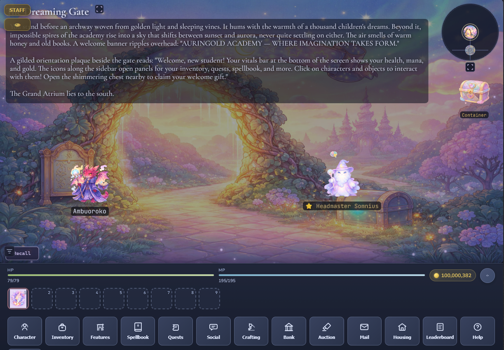
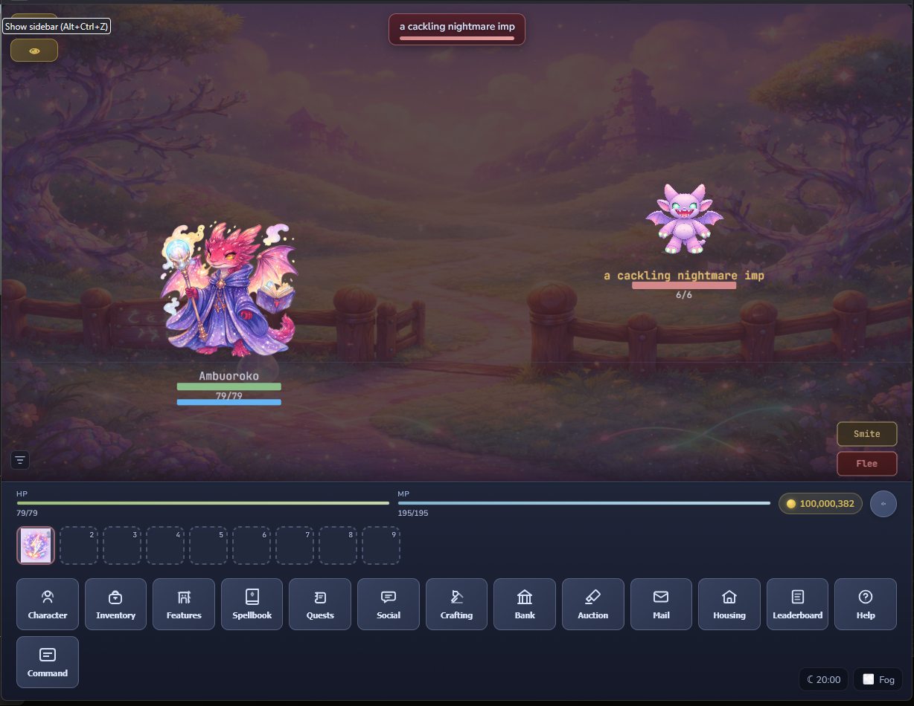
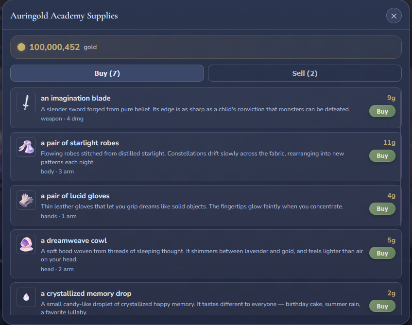
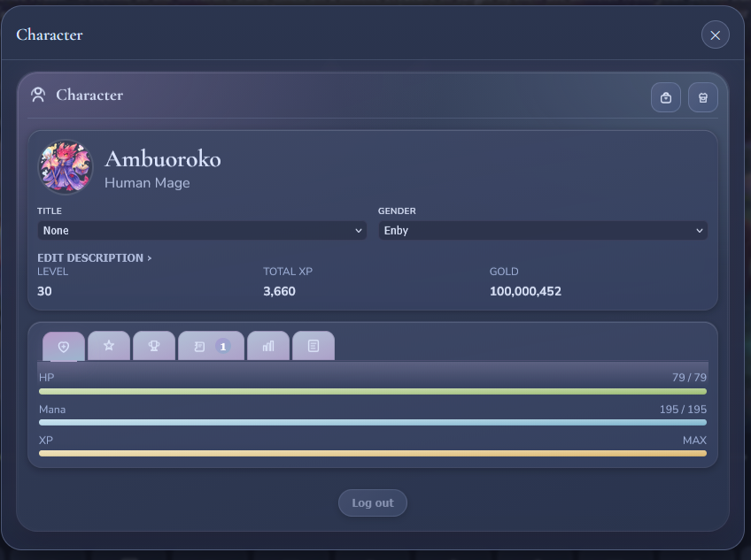
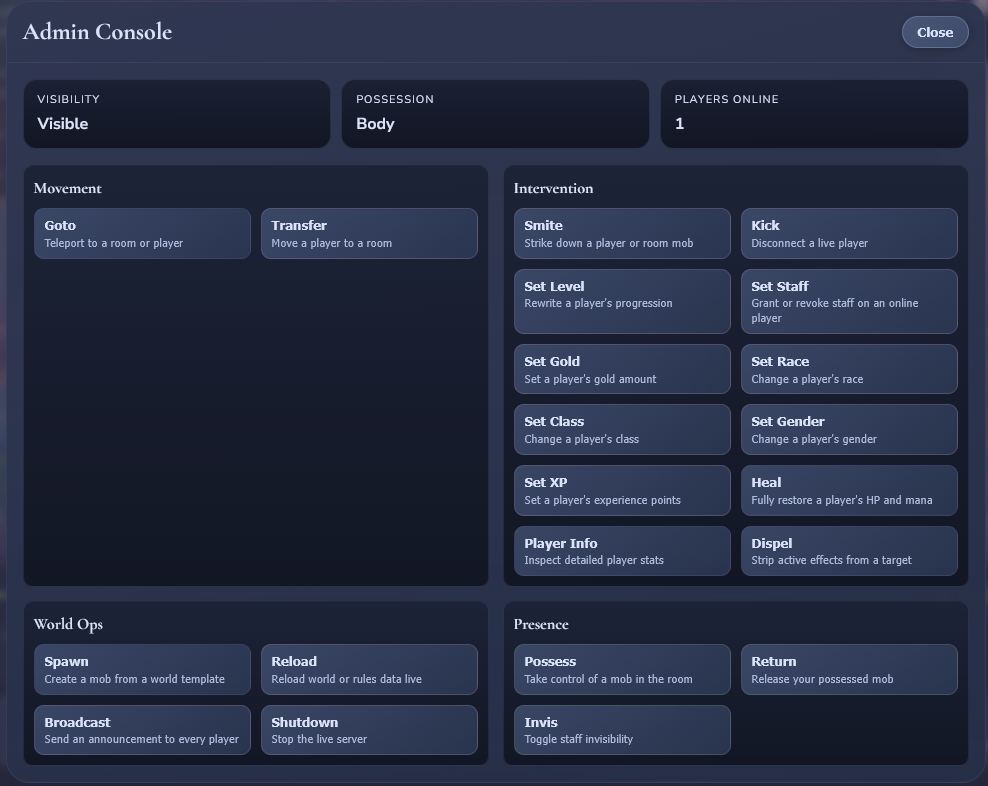

AmbonMUD
========

**AmbonMUD** is a cozy, magical MUD (Multi-User Dungeon) server written in Kotlin. It pairs the classic text-driven gameplay of a tick-based MUD engine with a PixiJS canvas client, GMCP-structured data, YAML-defined worlds, and a production AWS deployment path that scales from a single EC2 instance to a multi-engine ECS Fargate split.

**Live demo:** [https://mud.ambon.dev](https://mud.ambon.dev) — or `telnet mud.ambon.dev 4000`



---

## What it is

- **A game engine.** Single-threaded 100 ms tick loop, config-driven abilities and status effects, class-based progression, real-time combat, and a thick subsystem catalog: crafting, housing, dungeons, pets, factions, auction house, trading, PvP dueling, bank, guilds, friends/mail, quests, achievements, leaderboards, prestige, currencies, lottery, day/night/weather, and puzzles.
- **Two transports over one engine.** Telnet (with NAWS/TTYPE/GMCP negotiation) and Ktor WebSocket — both consume the same `InboundEvent`/`OutboundEvent` contract.
- **Data-driven content.** Worlds, abilities, status effects, stats, classes, races, and economy tuning all live in YAML/config — no recompilation for content changes.
- **Three deployment modes.** `STANDALONE` (single process), `ENGINE` (game logic + gRPC), `GATEWAY` (transports + gRPC client). Redis-backed zone sharding and zone instancing are available when you need horizontal scale.

See [`docs/ROADMAP.md`](docs/ROADMAP.md) for the full feature inventory and [`docs/ARCHITECTURE.md`](docs/ARCHITECTURE.md) for the architectural contracts and design decisions.

<details>
<summary><strong>More screenshots</strong></summary>

| Combat | Shop |
|--------|------|
|  |  |

| Character panel | Admin console |
|-----------------|---------------|
|  |  |

</details>

## Tech stack

| Layer | Choice |
|------|--------|
| Language / runtime | Kotlin 2.3, JDK 21 (virtual threads for telnet I/O) |
| Build | Gradle wrapper, ktlint, JaCoCo, Shadow (fat JAR) |
| Server | Ktor 3 (WebSocket), blocking socket transport (telnet), Netty |
| Config | Hoplite (YAML + env var overrides) |
| Persistence | YAML files (default), PostgreSQL via Exposed + Flyway (V1–V42), optional Redis L2 cache |
| Bus / RPC | Lettuce (Redis), gRPC 1.80 + Protobuf for ENGINE↔GATEWAY |
| Metrics | Micrometer → Prometheus |
| Web client | React 19, Vite, TypeScript, PixiJS 8, xterm.js (popout) — built with Bun |
| Infra | Docker, AWS CDK (TypeScript), ECS Fargate, EC2 (t4g.nano demo option) |

## Quick start

**Requirements:** JDK 21, Git. Bun is optional — the web client is prebuilt into `src/main/resources/web-v3/` and only rebuilds if you change `web-v3/` sources.

```bash
git clone https://github.com/jnoecker/AmbonMUD.git
cd AmbonMUD
./gradlew run            # Unix
.\gradlew.bat run        # Windows
```

Defaults: telnet `:4000`, web client `:8080`, YAML persistence under `data/players/`, Redis off, PostgreSQL off. No external services required.

Connect via telnet:

```bash
telnet localhost 4000
```

Full onboarding — prerequisites, project map, architecture, common tasks, troubleshooting — lives in **[docs/DEVELOPER_GUIDE.md](docs/DEVELOPER_GUIDE.md)**.

## World content

The repo ships with a single bundled starter zone (**Academy**) plus achievement and sprite definitions under `src/main/resources/world/`. 

Zone authoring format is documented in **[docs/WORLD_YAML_SPEC.md](docs/WORLD_YAML_SPEC.md)**.

## Project structure

```
src/main/kotlin/dev/ambon/
  Main.kt, MudServer.kt, GatewayServer.kt   # bootstrap
  config/                                   # AppConfig.kt schema + validated()
  engine/                                   # tick loop, systems, commands
    commands/handlers/                      # 37 handler files + EngineContext/HandlerHelpers support
    abilities/ status/ crafting/ dialogue/ ...
  transport/                                # telnet + Ktor WebSocket
  bus/                                      # Local/Redis/gRPC bus implementations
  persistence/                              # YAML + Postgres + write-coalescing + Redis cache
  sharding/                                 # ZoneRegistry, HandoffManager, InterEngineBus
  grpc/, redis/, session/, metrics/, admin/ # cross-cutting
  domain/                                   # RoomId, PlayerClass, Race, world model
src/main/resources/
  application.yaml                          # runtime config (~2000 lines)
  db/migration/                             # Flyway V1–V38
  world/                                    # Academy zone + achievements + sprites
  web-v3/                                   # built web client assets
src/main/proto/ambonmud/v1/                 # gRPC engine + event protos
src/test/kotlin/                            # ~175 test files
web-v3/                                     # React + PixiJS client source
infra/                                      # AWS CDK (EC2 + ECS Fargate topologies)
docs/                                       # architecture, guides, references
```

## Deployment

- **Local / dev:** `./gradlew run` (no external services).
- **Local with full stack:** `docker compose up -d` brings up PostgreSQL, Redis, Prometheus, Grafana. Then `./gradlew run -Pconfig.ambonmud.persistence.backend=POSTGRES -Pconfig.ambonmud.redis.enabled=true`.
- **Docker image:** `./gradlew shadowJar && docker build -t ambonmud .`
- **AWS EC2 demo** (~$4–5/mo, t4g.nano, YAML persistence, nginx TLS, auto-deploy from `main`): `cd infra && npx cdk deploy --context topology=ec2 ...`
- **AWS ECS Fargate:** `standalone` topology with managed Postgres + Redis, or `split` topology with separate auto-scaling ENGINE + GATEWAY services. Parameterized by `tier` (hobby / moderate / production).

Full deployment runbook — IAM bootstrap, OIDC roles, CDK topologies, env var reference, CI/CD, clean-redeploy checklist, R2 lore overlay, EC2 troubleshooting — is in **[docs/DEPLOYMENT.md](docs/DEPLOYMENT.md)**.

## Testing

```bash
./gradlew test                              # ~175 test files, unit suite
./gradlew integrationTest                   # integration-tagged suite
./gradlew test --tests "CommandParserTest"  # single class
./gradlew test --tests "*CommandRouter*"    # pattern
```

PostgreSQL tests use H2 in PostgreSQL-compatibility mode — no Docker required. See [docs/DEVELOPER_GUIDE.md#testing](docs/DEVELOPER_GUIDE.md) for patterns (deterministic `MutableClock`, `runTest` / `runCurrent` / `advanceTimeBy`, `outbound.drainAll()`, `@TempDir` isolation).

## Documentation map

**Start here**
- [docs/DEVELOPER_GUIDE.md](docs/DEVELOPER_GUIDE.md) — onboarding, project map, common tasks
- [docs/ARCHITECTURE.md](docs/ARCHITECTURE.md) — architectural contracts, data flow, and design decisions
- [docs/ROADMAP.md](docs/ROADMAP.md) — feature inventory (what's built)

**Protocol & content**
- [docs/GMCP_PROTOCOL.md](docs/GMCP_PROTOCOL.md) — full GMCP reference for client developers
- [docs/WORLD_YAML_SPEC.md](docs/WORLD_YAML_SPEC.md) — zone file format

**Web client & media**
- [docs/WEB_CLIENT.md](docs/WEB_CLIENT.md) — React + PixiJS architecture and visual progression
- [docs/ART_CONTRACT.md](docs/ART_CONTRACT.md) — painted UI art pipeline and the panel-reskin pattern
- [docs/VOICE_OVER_CONTRACT.md](docs/VOICE_OVER_CONTRACT.md) — NPC dialogue voice-over pipeline
- [docs/STYLE_GUIDE.md](docs/STYLE_GUIDE.md) — Surreal Gentle Magic design system
- [`.impeccable.md`](.impeccable.md) — brand personality and design principles

**Deployment & operations**
- [docs/DEPLOYMENT.md](docs/DEPLOYMENT.md) — Docker, CDK, CI/CD, runbook

**Contributor orientation**
- [CLAUDE.md](CLAUDE.md) — architectural contracts and change playbooks (read before editing)
- [AGENTS.md](AGENTS.md) — full engineering playbook
- [CODE_OF_CONDUCT.md](CODE_OF_CONDUCT.md)

