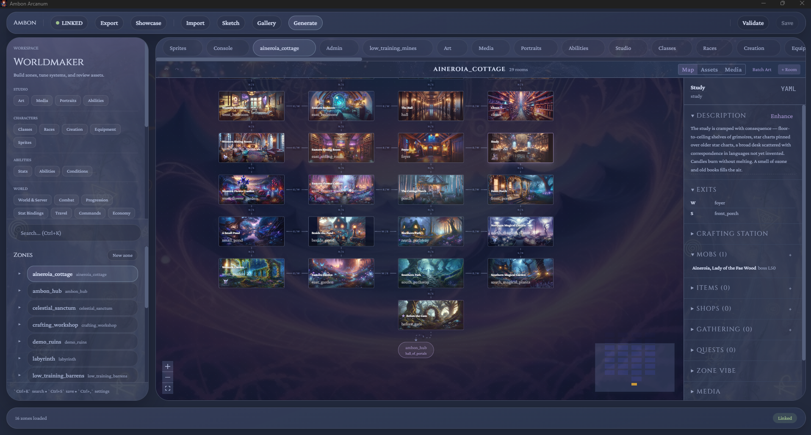

AmbonMUD
========

**AmbonMUD** is a cozy, magical MUD (Multi-User Dungeon) server built in Kotlin — a personal bucket-list project, portfolio showcase, and a game for family. It features a tick-based event loop, dual transports (telnet + WebSocket with a PixiJS canvas client), YAML-defined multi-zone worlds, class-based character progression with 112 abilities, real-time combat, and three deployment modes for horizontal scaling.

**Live demo:** [https://mud.ambon.dev](https://mud.ambon.dev) — or `telnet mud.ambon.dev 4000`

**Key Features**
- 🎮 **4 playable classes** (Warrior, Mage, Cleric, Rogue) with **112 abilities** — learned via class trainers using skill points; multi-classing lets players unlock additional class ability lists
- 🌍 **20 YAML-defined zones** with multi-zone support, cross-zone exits, and zone instancing for load distribution
- ⚔️ **Real-time combat system** with attribute-based damage, dodge mechanics, tactical status effects (DoT, HoT, STUN, ROOT, SHIELD, buffs/debuffs), and consent-based PvP dueling
- 🎨 **PixiJS canvas client** with JRPG-style world/battle scenes, spell targeting, customizable quickbar, and a cozy glass-morphism UI
- 🐾 **Pet/companion system**: summon familiars and companions via abilities; pets follow the owner between rooms and assist in combat
- 🏆 **Faction & reputation system**: standing with factions (Hated → Revered) changes based on kills and quest rewards; enemy faction relationships auto-apply
- 🛒 **Auction house**: player-driven marketplace for listing, browsing, and purchasing items; listings persist to `data/auction_listings.json`
- 🤝 **Player trading**: direct item and gold transfers with an interactive confirmation flow
- 🏠 **Player housing**: personal rooms, furniture placement, vaults with capacity limits, and access control
- 🏰 **Procedural dungeons**: template-driven instanced dungeons with 4 difficulty tiers, party scaling, boss encounters, and loot tables
- 💰 **Economy system**: gold drops, item pricing, shops, `buy`/`sell` commands, bank NPCs for gold/item storage, item enchanting for stat bonuses
- 🌤️ **Living world**: day/night cycle, dynamic per-zone weather (6 types), and date-based seasonal events with world flag support
- 🔌 **Dual transports**: telnet (NAWS/TTYPE/GMCP negotiation) + browser WebSocket with GMCP-aware UI panels
- 📊 **Structured data** (GMCP) — 25+ packages over telnet and WebSocket; see [GMCP_PROTOCOL.md](docs/GMCP_PROTOCOL.md)
- 💾 **Flexible persistence**: YAML files by default (zero-dependency), PostgreSQL with optional Redis L2 caching available
- 🌐 **Three deployment modes**: STANDALONE (single-process), ENGINE (game logic + gRPC), GATEWAY (transports + gRPC) for horizontal scaling
- 🗺️ **Zone-based sharding** with inter-engine messaging, player handoff, and O(1) cross-engine `tell` routing
- 🔒 **gRPC HMAC authentication** with replay-protected shared-secret interceptor for ENGINE↔GATEWAY trust boundary
- 🛡️ **Production mode** with fail-fast validation rejecting placeholder secrets, configurable metrics bind address, and admin rate limiting
- 🧵 **JVM virtual threads** for telnet I/O (JDK 21) — eliminates carrier-thread pinning under load
- 📈 **Prometheus metrics** for monitoring and load testing integration
- ✅ **~144 test files** covering all systems; CI validates against Java 21 with ktlint and JaCoCo coverage

**Current State** (Apr 2026)
- ✅ All 6 scalability phases complete (bus abstraction, async persistence, Redis, gRPC gateway, zone sharding, production AWS infrastructure)
- ✅ 112 abilities across 4 classes — trainer-based learning via skill points (1 point per 2 levels); multi-classing unlockable at level 10
- ✅ PixiJS canvas game client with JRPG-style world/battle scenes
- ✅ GMCP support with 25+ outbound packages (telnet + WebSocket); see [GMCP_PROTOCOL.md](docs/GMCP_PROTOCOL.md)
- ✅ Quest system, achievement system, group/party system, dialogue trees, NPC behavior trees
- ✅ Guild system with hierarchy, guild chat, MOTD
- ✅ Friends list and in-game mail system
- ✅ Crafting and gathering with specialization, recipe discovery, quality tiers, rare yields, and item enchanting
- ✅ Player housing with furniture, vaults, and access control
- ✅ Procedural dungeons with difficulty scaling and boss encounters
- ✅ Pet/companion system with level-scaled familiar summoning
- ✅ Faction & reputation system with 7 standing tiers
- ✅ Auction house / player marketplace with persistent listings
- ✅ Player-to-player trading with confirmation flow
- ✅ Consent-based PvP dueling
- ✅ Bank NPC system for gold and item storage
- ✅ Day/night cycle, dynamic per-zone weather, seasonal events
- ✅ Leaderboard system and hall of fame
- ✅ Remember-me auth tokens with character picker
- ✅ Full production test coverage and CI/CD
- ✅ Docker image + AWS CDK infrastructure: EC2 demo (~$4-5/mo) and ECS Fargate (topology × tier) options
- ✅ Live demo at [mud.ambon.dev](https://mud.ambon.dev) — auto-deploys on every push to `main`

Screenshots
-----------
Current web client (v4 — PixiJS canvas):


See [docs/WEB_CLIENT.md](docs/WEB_CLIENT.md#visual-progression) for the full progression from telnet proof-of-concept to the current UI.

Ambon Arcanum (Creator Tool)
-----------------------------

**Ambon Arcanum** is a standalone desktop application for building and managing AmbonMUD worlds. Point it at your AmbonMUD project directory and it becomes the single tool for creating zones, rooms, mobs, items, shops, classes, races, and server configuration — all through visual editors with full YAML round-trip preservation.



The Arcanum includes a visual zone map editor, entity editors with live preview, a class/race designer, and a config editor for all gameplay tuning. See [docs/CREATOR_PLAN.md](docs/CREATOR_PLAN.md) for the design document and [docs/ARCANUM_STYLE_GUIDE.md](docs/ARCANUM_STYLE_GUIDE.md) for its design system.

## Quick Start

**Requirements:** JDK 21, Gradle wrapper (included in repo)

**Start the server** (YAML persistence, no external services needed):
```bash
./gradlew run          # Unix
.\gradlew.bat run      # Windows
```

**Launch browser demo:**
```bash
./gradlew demo         # Auto-opens http://localhost:8080
```

**Connect via telnet:**
```bash
telnet localhost 4000
```

By default: telnet on **:4000**, web on **:8080** (configurable in `src/main/resources/application.yaml`).

**To use PostgreSQL + Redis locally**, bring up the Docker Compose stack first:
```bash
docker compose up -d
./gradlew run -Pconfig.ambonmud.persistence.backend=POSTGRES -Pconfig.ambonmud.redis.enabled=true
```

> **Note:** The web client is a PixiJS canvas app with React panels. For offline or minimal use, connect via telnet.

## Configuration & Deployment

**Runtime config** is loaded from `src/main/resources/application.yaml`. Override any value at startup:

```bash
./gradlew run -Pconfig.ambonmud.server.telnetPort=5000
./gradlew run -Pconfig.ambonmud.persistence.backend=YAML
./gradlew run -Pconfig.ambonmud.redis.enabled=false
./gradlew run -Pconfig.ambonmud.logging.level=DEBUG
```

See [DEVELOPER_GUIDE.md](docs/DEVELOPER_GUIDE.md#configuration) for detailed configuration options and multi-instance setup.

**Deployment Modes:**
- **STANDALONE** (default): Single-process app using localhost Postgres/Redis by default
- **ENGINE**: Game logic + persistence + gRPC server for remote gateways
- **GATEWAY**: Transports (telnet/WebSocket) + gRPC client to a remote engine

See [ARCHITECTURE.md](docs/ARCHITECTURE.md) for architectural details and [DEVELOPER_GUIDE.md](docs/DEVELOPER_GUIDE.md#deployment-modes) for setup instructions.

## Gameplay

**Character Creation**
- Name: 2-16 chars (alnum/underscore, cannot start with digit)
- Password: 1-72 chars (bcrypt hashed)
- Race: Human, Elf, Dwarf, Halfling (each has attribute modifiers)
- Class: Warrior, Mage, Cleric, Rogue (102 abilities across all classes, levels 1–50)

**Core Commands**
- **Movement:** `n`/`s`/`e`/`w`/`u`/`d`, `look`, `exits`
- **Combat:** `kill <mob>`, `flee`, `cast <spell>`, `spells`, `effects`
- **Items:** `inventory`, `equipment`, `get`, `drop`, `wear`, `remove`, `use`, `give`
- **Communication:** `say`, `tell`, `gossip`, `whisper`, `shout`, `emote`, `ooc`, `pose`
- **Character:** `score`, `gold`, `help`, `who`, `quit`
- **Economy:** `buy`, `sell`, `list` (in shops); `auction [filter]`, `auction sell <item> <price>`, `auction buy <#>`, `auction cancel <#>`
- **Bank:** `deposit`, `withdraw`, `bank` (in bank rooms)
- **Trading:** `trade <player>`, `trade offer <item/gold>`, `trade accept`, `trade cancel`
- **Zones:** `phase` (switch zone instances)
- **Guilds:** `guild create/disband/invite/accept/leave/kick/promote/demote/motd/roster/info`, `gchat`
- **Friends:** `friend list/add/remove`
- **Mail:** `mail list/read/send/delete`
- **Crafting:** `gather`, `craft`, `recipes`, `enchant <item>`, `enchantments`
- **Housing:** `house` (info/expand/furnish/describe/invite/kick/lock/unlock)
- **Dungeons:** `dungeon enter <name> [difficulty]`, `dungeon leave`
- **Pets:** `pet`, `pet dismiss`, `pet name <name>`
- **Reputation:** `reputation` (view faction standings)
- **Dueling:** `duel <player>`, `duel accept`, `duel decline`
- **Training:** `train list`, `train learn <ability>`, `train unlock` (multi-class)
- **World:** `time` (day/night period and weather)
- **Leaderboards:** `leaderboard`, `halloffame`
- **Admin:** `goto`, `transfer`, `spawn`, `smite`, `kick`, `shutdown` (requires staff flag)

See [DEVELOPER_GUIDE.md](docs/DEVELOPER_GUIDE.md#gameplay-reference) for full command list and details.

**Abilities, Training & Combat**
- **102 total abilities** across 4 classes (levels 1–50), learned at **class trainers** using skill points (1 point per 2 levels)
- **Multi-classing:** unlock additional class ability lists at level 10 for a gold cost — spend skill points across multiple classes
- **Status effects:** DoT, HoT, STAT_BUFF/DEBUFF, STUN, ROOT, SHIELD with configurable stacking
- **Attributes:** STR (melee damage), DEX (dodge), CON (HP regen), INT (spell damage), WIS (mana regen), CHA
- **Real-time combat** with attribute-based damage scaling, dodge mechanics, and tactical depth
- **Consent-based PvP dueling:** challenge other players to duels; outcomes have no item loss

## World Content

**World files** live in `src/main/resources/world/` and are loaded by `WorldLoader`. Each YAML file describes one zone; multiple zones are merged into a single world.

**Current Zones (23 YAML files — 20 zones + 3 data files):**
| Zone | Description |
|------|-------------|
| `crossroads_path` | Central crossroads connecting all zones |
| `thornhaven_city` | Main city hub with shops, trainers, and services |
| `thornwood_forest` | Forested wilderness with gathering nodes |
| `farmer_fields` | Farmland area outside the city |
| `cobblestone_road` | Road connecting city to wilderness |
| `highland_trails` | Highland paths with crafting resources |
| `old_mines` | Abandoned mines with ore deposits |
| `marsh_of_fog` | Foggy marshland with herb gathering |
| `goblin_warrens` | Goblin-infested tunnels |
| `dark_barrows` | Undead burial grounds |
| `sea_cliffs` | Coastal cliffs with sea creatures |
| `sunken_temple` | Underwater temple ruins |
| `ruined_fortress` | Crumbling fortress with tough encounters |
| `shadowmere_fen` | Dark swamp with shadow creatures |
| `thornhaven_sewers` | City sewers beneath Thornhaven |
| `haunted_manor` | Ghost-infested manor house |
| `barrens_wastes` | Desolate wasteland |
| `frost_caverns` | Icy caves with frost creatures |
| `celestial_peak` | Endgame mountain summit |
| `dungeon_of_echoes` | Procedural dungeon with scaling difficulty |
| `achievements` | Achievement definitions |
| `player_sprites` | Player sprite data for the canvas client |
| `sprites` | Achievement sprite definitions |

**Zone YAML Format**
```yaml
zone: demo_zone
startRoom: entrance
rooms:
  entrance:
    title: "Forest Entrance"
    description: "You stand at the edge of a vast forest."
    exits:
      north: clearing
mobs:
  wolf:
    name: "a wary wolf"
    room: entrance
    respawnSeconds: 60
items:
  potion:
    displayName: "a healing potion"
    consumable: true
    onUse:
      healHp: 20
shops:
  general_store:
    room: entrance
    keeperName: "the merchant"
```

See [WORLD_YAML_SPEC.md](docs/WORLD_YAML_SPEC.md) for full schema documentation (rooms, mobs, items, shops, behaviors, dialogues).

## Testing & Build

**Run tests:**
```bash
./gradlew test                    # Full test suite
./gradlew test --tests "ClassName"  # Single test class
```

**Lint (Kotlin style):**
```bash
./gradlew ktlintCheck
```

**CI parity check** (recommended before finalizing):
```bash
./gradlew ktlintCheck test
```

## Persistence

**Backends** (selectable via `ambonmud.persistence.backend`):
- **YAML** (default): File-backed, zero dependencies, player files in `data/players/`
- **PostgreSQL**: Database-backed (schema via Flyway migrations V1–V27); requires `ambonmud.database.jdbcUrl`

Redis L2 caching is disabled by default. Enable it with `ambonmud.redis.enabled=true` when running alongside the Docker Compose stack.

**Grant staff access:**
- YAML: Add `isStaff: true` to player YAML file
- PostgreSQL: Set `is_staff = true` in the `players` table

See [DEVELOPER_GUIDE.md](docs/DEVELOPER_GUIDE.md#persistence) for detailed persistence setup.

## Infrastructure & Deployment

**Docker Compose** (local Prometheus, Grafana, Redis, PostgreSQL):
```bash
docker compose up -d   # then ./gradlew run with postgres/redis flags
```

**Build and run as a Docker container:**
```bash
docker build -t ambonmud .
docker run --rm -p 4000:4000 -p 8080:8080 -v ./data:/app/data ambonmud
```

---

### EC2 Demo (~$4-5/mo) — replicating mud.ambon.dev

The live demo runs on a single ARM64 t4g.nano with YAML persistence, nginx TLS, and auto-deploy on every push to `main`. To replicate it:

**1. One-time AWS setup**

Create an ECR repository named `ambonmud/app`, then create two IAM roles with OIDC trust for GitHub Actions (repo `your-org/your-repo`):

| Role name | Purpose | Key permissions |
|-----------|---------|-----------------|
| `GitHubActions-EcrPush` | CI pushes Docker images | `ecr:GetAuthorizationToken`, `ecr:BatchCheckLayerAvailability`, `ecr:PutImage`, etc. |
| `GitHubActions-Ec2Demo` | Deploy workflow SSMs the instance | `ssm:SendCommand`, `ssm:GetCommandInvocation` on the instance |

**2. Deploy the CDK stack**

```bash
cd infra && npm ci
npx cdk bootstrap   # first time only

# Deploy the EC2 stack — provisions instance, EIP, security groups, helper scripts
npx cdk deploy --context topology=ec2 \
  --context imageTag=latest \
  --context hostname=mud.yourdomain.com
```

Note the `InstanceId` and `PublicIp` from the CDK outputs.

**3. Point DNS and provision TLS**

Add an A record at your DNS provider: `mud.yourdomain.com` → `<PublicIp>`

Once DNS propagates, open an SSM shell and run the TLS helper:
```bash
aws ssm start-session --target <instance-id> --region us-east-1
$ setup-tls          # runs certbot, configures nginx, sets up auto-renewal
```

**4. Set GitHub repo variables** (Settings → Secrets and variables → Variables):

| Variable | Value |
|----------|-------|
| `AWS_ECR_PUSH_ROLE_ARN` | ARN of `GitHubActions-EcrPush` |
| `AWS_EC2_DEMO_ROLE_ARN` | ARN of `GitHubActions-Ec2Demo` |
| `DEMO_INSTANCE_ID` | EC2 instance ID from CDK output |
| `AWS_REGION` | e.g. `us-east-1` |

After this, every push to `main` automatically:
1. Runs `ktlintCheck test` + builds the web frontend
2. Builds and pushes an ARM64 Docker image to ECR (native runner, no QEMU)
3. SSMs `update-ambonmud <sha>` to pull the new image and restart the service

**Manual redeploy** (if needed):
```powershell
aws ssm send-command `
  --instance-ids <instance-id> `
  --document-name AWS-RunShellScript `
  --parameters 'commands=["update-ambonmud latest"]' `
  --region us-east-1
```

---

**ECS Fargate** (managed, scalable):
```bash
cd infra && npm ci

# Standalone (~$60-100/mo): single process, managed Postgres + Redis
npx cdk deploy --all --context topology=standalone --context tier=hobby

# Split production HA: separate ENGINE + GATEWAY with auto-scaling
npx cdk deploy --all --context topology=split --context tier=production \
  --context domain=play.example.com --context alertEmail=ops@example.com
```

See [docs/DEPLOYMENT.md](docs/DEPLOYMENT.md) for the full deployment guide (Docker, CDK, CI/CD, operational notes).

## Design

AmbonMUD's visual identity is **Surreal Gentle Magic** — a cozy fantasy aesthetic with glass-morphism depth, jewel-toned colors, and ambient magical details. The brand personality is *surreal, magical, adventure* — evoking the warmth of Stardew Valley with an ever-present magical undertone.

- [`.impeccable.md`](.impeccable.md) — Design context: users, brand personality, aesthetic direction, design principles
- [`docs/STYLE_GUIDE.md`](docs/STYLE_GUIDE.md) — Full design system: color tokens, typography, motion, component states
- [`docs/ARCANUM_STYLE_GUIDE.md`](docs/ARCANUM_STYLE_GUIDE.md) — Ambon Arcanum (creator tool) design system

## Architecture & Development

**Scalability** has 6 complete phases:
1. Event bus abstraction (InboundBus/OutboundBus, SessionIdFactory)
2. Async persistence worker (write-behind coalescing)
3. Redis integration (L2 cache + pub/sub)
4. gRPC gateway split (multi-gateway horizontal scaling)
5. Zone-based engine sharding (multi-engine with zone instancing)
6. Production AWS infrastructure (Docker, CDK, ECS Fargate, NLB/ALB, CI/CD)

**Architecture & Design**
- [ARCHITECTURE.md](docs/ARCHITECTURE.md) — Architectural principles and design decisions
- [docs/DEPLOYMENT.md](docs/DEPLOYMENT.md) — Docker build, CDK deploy, topology/tier reference, CI/CD
- [docs/WORLD_YAML_SPEC.md](docs/WORLD_YAML_SPEC.md) — Zone YAML format specification
- [docs/WEB_CLIENT.md](docs/WEB_CLIENT.md) — Web client architecture (React + PixiJS canvas)
- [docs/WEB_CLIENT_PARITY_REPORT.md](docs/WEB_CLIENT_PARITY_REPORT.md) — Web client feature parity analysis and gaps
- [docs/GMCP_PROTOCOL.md](docs/GMCP_PROTOCOL.md) — GMCP protocol reference for client developers

**Gameplay Systems**
- [docs/CRAFTING.md](docs/CRAFTING.md) — Crafting & gathering system reference
- [docs/DUNGEON_TEMPLATE_REFERENCE.md](docs/DUNGEON_TEMPLATE_REFERENCE.md) — Procedural dungeon template format and creation guide
- [docs/FRIENDS_MAIL.md](docs/FRIENDS_MAIL.md) — Friends list and in-game mail
- [docs/TRAINER_SYSTEM.md](docs/TRAINER_SYSTEM.md) — Trainer-based ability learning, skill points, and multi-classing

**Developer Resources**
- [DEVELOPER_GUIDE.md](docs/DEVELOPER_GUIDE.md) — Complete onboarding from zero to productive
- [docs/ROADMAP.md](docs/ROADMAP.md) — Planned features and future work
- [docs/SCALING_STORY.md](docs/SCALING_STORY.md) — Scaling architecture narrative and load test results
- [CLAUDE.md](CLAUDE.md) — Internal development directives for Claude Code
- [AGENTS.md](AGENTS.md) — Engineering playbook for code changes

**Creator Tool (Ambon Arcanum)**
- [docs/CREATOR_PLAN.md](docs/CREATOR_PLAN.md) — Creator tool design plan
- [docs/CREATOR_CONFIG_REFERENCE.md](docs/CREATOR_CONFIG_REFERENCE.md) — All configurable YAML keys for world builders
- [docs/ADMIN_API_REFERENCE.md](docs/ADMIN_API_REFERENCE.md) — Admin HTTP server JSON API reference

**Data-Driven Systems**
- [docs/DATA_DRIVEN_YAML_CONTRACT.md](docs/DATA_DRIVEN_YAML_CONTRACT.md) — YAML contract spec for all data-driven game mechanics
- [docs/DATA_DRIVEN_STATS_PLAN.md](docs/DATA_DRIVEN_STATS_PLAN.md) — Data-driven stats engineering plan (completed, historical reference)
- [docs/DATA_DRIVEN_GAP_AUDIT.md](docs/DATA_DRIVEN_GAP_AUDIT.md) — Remaining code-level constraints for future data-driven migration
- [docs/ARCANUM_SPRITE_INSTRUCTIONS.md](docs/ARCANUM_SPRITE_INSTRUCTIONS.md) — Sprite image naming conventions and guidelines

**Design Systems**
- [.impeccable.md](.impeccable.md) — Design context, brand personality, design principles
- [docs/STYLE_GUIDE.md](docs/STYLE_GUIDE.md) — Surreal Gentle Magic design system (game client)
- [docs/ARCANUM_STYLE_GUIDE.md](docs/ARCANUM_STYLE_GUIDE.md) — Ambon Arcanum design system (creator tool)

## Contributing

To contribute, see [DEVELOPER_GUIDE.md](docs/DEVELOPER_GUIDE.md#contributing) for workflow and [CLAUDE.md](CLAUDE.md) for architectural contracts and change playbooks.

Questions? Open an issue or see the documentation above.
