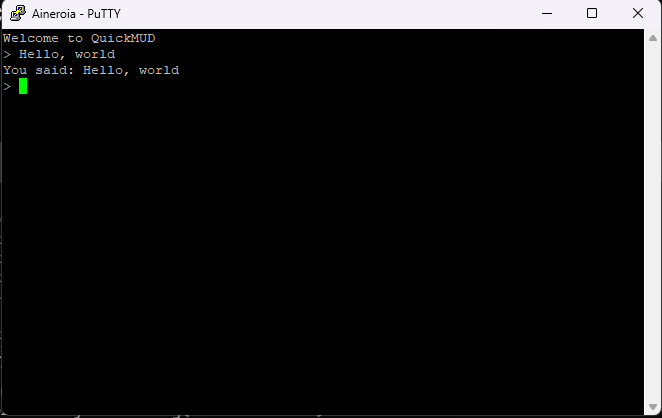
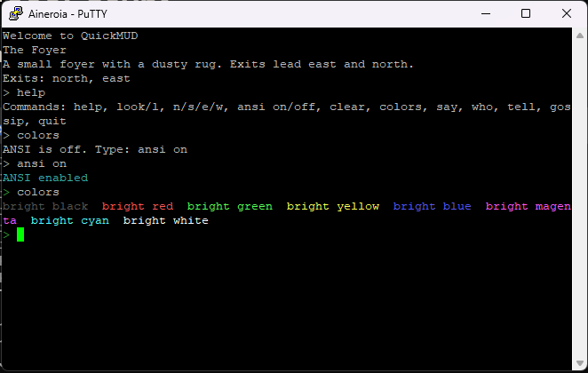
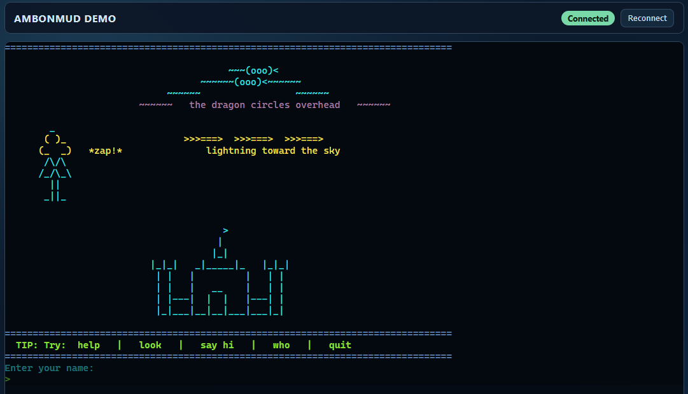
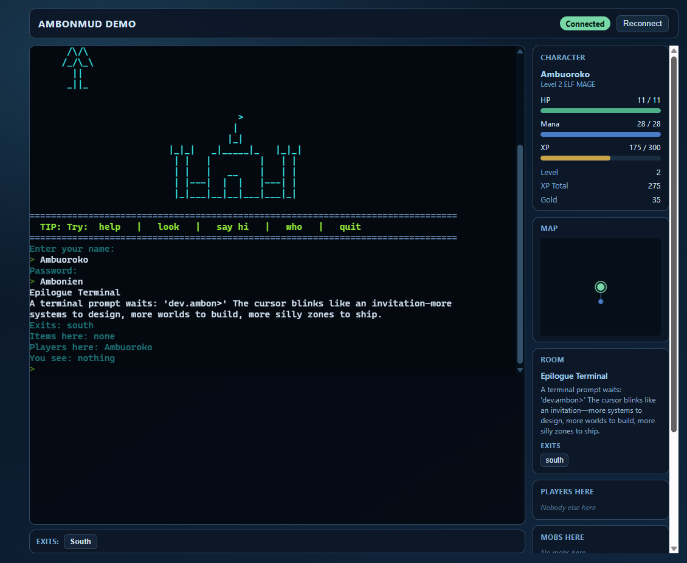

# Web Client

*Consolidates: WEB_CLIENT_V3.md, V4_GAME_CLIENT.md, WEB_V3_CURRENT_STATE.md, WEB_V3_FRONTEND_STRUCTURE.md, WEB_V3_GAPS_NEXT_STEPS.md*

The web client is a modular React + Vite + TypeScript single-page application served by the Ktor backend. It combines a PixiJS 2D canvas (primary game view) with React side panels, connected to the server over WebSocket using a GMCP-over-JSON protocol alongside plain MUD text.

---

## Visual Progression

Five generations of the client, from the earliest telnet proof-of-concept to the current canvas UI.

### v0 — Telnet (PuTTY)
Plain telnet, no web client. The very first proof of concept running as "QuickMUD".



### v0.5 — Telnet with ANSI
Same telnet client with ANSI color support enabled — the first sign of life for the room/look system.



### v1 — First Web Client
A single-page web terminal. Dark background, ASCII art login banner, basic Connected/Reconnect buttons. No panels.



### v2 — Web Client + Panels
Added a character sidebar (HP/mana/XP bars), a mini-map (dot tracking visited rooms), and a room info panel on the right.



### v3 — Surreal Gentle Magic
Full redesign: dark glassmorphism panels, banner artwork, tabbed Play/Character/Social/World layout, GMCP-driven skills and combat view.


### v4 — PixiJS Canvas (Current)
PixiJS canvas replaces the xterm terminal as the primary game view. Terminal moved to popout (available on command input focus). JRPG-style world and battle scenes with sprite-based rendering. Side panels preserved.

---

## Architecture

### Layout: JRPG Canvas + WoW-Style Panels

The PixiJS canvas occupies the space the terminal previously held — it's the primary game view. Surrounding panels (World, Chat, Character) stay in place as persistent HUD elements. Popouts (map, equipment, room details, terminal) overlay the canvas when opened.

```
┌──────────────────────────────────────────────────────────┐
│                      App Shell                           │
│  ┌──────────────────────────────┐  ┌──────────────────┐ │
│  │     PixiJS Canvas            │  │  React Panels    │ │
│  │  ┌────────────────────────┐  │  │  - WorldPanel    │ │
│  │  │     SceneManager       │  │  │  - ChatPanel     │ │
│  │  │  ┌────────┐ ┌───────┐ │  │  │  - CharPanel     │ │
│  │  │  │ World  │ │Battle │ │  │  │  - CombatPanel   │ │
│  │  │  │ Scene  │ │Scene  │ │  │  │  - AdminPanel    │ │
│  │  │  └────────┘ └───────┘ │  │  │                   │ │
│  │  └────────────────────────┘  │  └──────────────────┘ │
│  │  [Command Input Bar]        │                        │
│  └──────────────────────────────┘                        │
│  ┌─────────────────────────────────────────────────────┐ │
│  │  Popout Layer                                        │ │
│  │  map | equipment | room | help | terminal | spellbook│ │
│  └─────────────────────────────────────────────────────┘ │
│  ┌─────────────────────────────────────────────────────┐ │
│  │  GameStateBridge                                     │ │
│  │  React useState → shared ref object → PixiJS reads  │ │
│  └─────────────────────────────────────────────────────┘ │
│  ┌─────────────────────────────────────────────────────┐ │
│  │  Existing: useMudSocket, applyGmcpPackage, types.ts │ │
│  └─────────────────────────────────────────────────────┘ │
└──────────────────────────────────────────────────────────┘
```

### Tech Stack

| Component | Version | Purpose |
|-----------|---------|---------|
| **React** | 19 | UI framework |
| **Vite** | latest | Build tool |
| **TypeScript** | latest | Type safety |
| **PixiJS** | 8.x | 2D WebGL/WebGPU sprite engine for game canvas |
| **xterm.js** | latest | Terminal (retained for popout) |

### Serving & Build

- **Source project:** `web-v3/`
- **Build output:** `src/main/resources/web-v3/` (written by `bun run build`)
- **Served by:** Ktor static resources at `/`
- **Compatibility:** `/v3` and `/v3/` redirect to `/`
- **WebSocket endpoint:** `/ws`

### State Bridge Pattern

PixiJS code runs outside React's render cycle. A lightweight bridge exposes current state to the canvas via a mutable ref object (`GameStateBridge.ts`). React syncs the ref in a `useEffect`; PixiJS reads it each frame tick.

For push events (combat events, gain popups), `CanvasEventBus.ts` provides a ring buffer that PixiJS drains each frame.

### Runtime Data Flow

1. Browser connects to `ws(s)://<host>/ws`
2. Ktor bridge registers the session and emits `InboundEvent.Connected`
3. WS transport auto-sends `InboundEvent.GmcpReceived(Core.Supports.Set, [...])` for supported packages
4. Engine `GmcpEventHandler` stores package support and emits initial snapshots
5. Outbound GMCP is serialized as JSON envelope: `{"gmcp":"<Package>","data":<json>}`
6. Frontend routes by package in `applyGmcpPackage.ts`

---

## File Structure

```
web-v3/src/
├── canvas/                          # PixiJS code
│   ├── GameStateBridge.ts           # Shared ref for React → PixiJS state
│   ├── CanvasEventBus.ts            # Push events (combat hits, gains)
│   ├── PixiCanvas.tsx               # React component wrapping PixiJS Application
│   ├── LoginModal.tsx               # Modal login form (name, password, race/class selection)
│   ├── SceneManager.ts              # Scene state machine (world ↔ battle ↔ transition)
│   ├── scenes/
│   │   ├── WorldScene.ts            # Room view, player/NPC sprites, exits
│   │   └── BattleScene.ts           # JRPG battle view driven by combat events
│   └── systems/
│       ├── CombatAnimator.ts        # Combat event → sprite animations
│       ├── GainPopup.ts             # Floating XP/gold/level-up numbers
│       ├── StatusEffectDisplay.ts   # Buff/debuff icons
│       ├── Minimap.ts               # Canvas-based minimap
│       ├── DialogueOverlay.ts       # NPC dialogue on canvas
│       └── EntityPopout.ts          # Click-to-interact on sprites
├── App.tsx                          # Composition root, state management
├── gmcp/applyGmcpPackage.ts        # GMCP package → state updates
├── components/
│   ├── panels/                      # PlayPanel, WorldPanel, ChatPanel, CharacterPanel
│   ├── PopoutLayer.tsx              # Overlay panels (map, equipment, terminal, spellbook)
│   ├── SpellbookPanel.tsx           # Ability grid with target type filtering
│   └── ...
├── hooks/
│   ├── useMudSocket.ts              # WebSocket lifecycle
│   ├── useCommandHistory.ts         # Command history + tab completion
│   ├── useMiniMap.ts                # Visited-room graph
│   └── useQuickbar.ts              # 9-slot quickbar (localStorage persisted)
├── types.ts                         # Shared TypeScript types
└── styles.css                       # Surreal Gentle Magic design system
```

---

## GMCP Packages

### Packages Handled by the Client

| Package | What It Drives |
|---------|----------------|
| `Char.Vitals` | HP/MP bars, combat state |
| `Char.Name` | Player identity, sprite selection |
| `Char.Stats` | Attribute display |
| `Char.Skills` | Spellbook panel, quickbar |
| `Char.StatusEffects` | Buff/debuff icons |
| `Char.Combat` | Battle scene transition |
| `Char.Combat.Event` | Per-hit animations, damage numbers |
| `Char.Cooldown` | Cooldown overlays |
| `Char.Gain` | XP/gold/level-up popups |
| `Char.Achievements` | Achievement panel |
| `Char.Items.List` | Inventory/equipment |
| `Char.Items.Add` / `Remove` | Inventory updates |
| `Room.Info` | Room rendering, transitions |
| `Room.Players` / `AddPlayer` / `RemovePlayer` | Player sprites |
| `Room.Mobs` / `AddMob` / `RemoveMob` / `UpdateMob` | NPC sprites, HP bars |
| `Room.MobInfo` | Quest marker / shop / dialogue icons |
| `Room.Items` | Item sprites on ground |
| `Comm.Channel` | Chat panel |
| `Group.Info` | Party widget |

Unknown packages are ignored. Package matching in `GameEngine` is prefix-aware (`Char.Items` enables `Char.Items.*`).

### Canvas Features Driven by GMCP

| Canvas Feature | GMCP Source |
|---------------|-------------|
| Room rendering | `Room.Info` |
| Player sprite | `Char.Name` |
| NPCs in room | `Room.Mobs`, `Room.AddMob`, `Room.RemoveMob` |
| Combat start/end | `Char.Combat`, `Char.Vitals` (`inCombat`) |
| Combat animations | `Char.Combat.Event` |
| Damage/heal numbers | `Char.Combat.Event` |
| XP/gold popups | `Char.Gain` |
| Cooldowns | `Char.Cooldown`, `Char.Skills` |
| Status effects | `Char.StatusEffects` |
| Room transitions | `Room.Info` (room change) |

---

## Key Design Decisions

### Terminal as Popout
The xterm terminal is not removed — it's always mounted (even when the popout is closed) so it stays in sync with server output. Opening the terminal popout shows full scrollback. This provides a fallback for gameplay not yet visually represented and a debug view for raw server output.

### Combat Event Animation Queue
`Char.Combat.Event` packets arrive individually. The `CombatAnimator` maintains a FIFO queue — each frame, it dequeues the next event and maps it to animations. Animations can overlap (damage numbers float independently of sprite animations).

### Click-to-Interact
Canvas sprites are clickable. Clicking sends the same commands the panels send (e.g., click mob → `kill <mob>`, click item → `get <item>`). All commands go through `sendCommand` — the canvas never touches the WebSocket directly.

### Spell Targeting System
Target-required spells (ENEMY/ALLY) auto-target the current combat target, or enter targeting mode. Targeting mode shows a canvas banner + toast; click a mob/player sprite to complete the cast, Escape to cancel, 4-second timeout.

### Customizable Quickbar
9-slot quickbar persisted in localStorage. Drag-and-drop reorder, right-click to clear, keyboard shortcuts 1-9. Assigned from the spellbook panel.

---

## Validation

Run from `web-v3/`:
```bash
bun run lint
bun run build
```

CI (`.github/workflows/ci.yml`) runs both `bun run lint` and `bun run build` on every push and PR.

---

## Known Gaps

1. **Local dev ergonomics** — v3 dev server setup does not document a WS proxy to backend `/ws`
2. **Limited frontend test coverage** — UI and GMCP reducer regressions rely on manual testing
3. **Heuristic client map** — Map graph inferred from observed exits/room IDs; no persistence across reconnects
4. **Large frontend bundle** — Main JS chunk exceeds 500 kB; lazy-loading recommended

---

## Key Source Files (Server Side)

- Transport boundary: `src/main/kotlin/dev/ambon/transport/KtorWebSocketTransport.kt`
- Engine GMCP publish: `src/main/kotlin/dev/ambon/engine/GmcpEmitter.kt`
- Routing/asset verification: `src/test/kotlin/dev/ambon/transport/KtorWebSocketTransportTest.kt`

## Further Reading

- [GMCP_PROTOCOL.md](./GMCP_PROTOCOL.md) — Full GMCP protocol reference
- [STYLE_GUIDE.md](./STYLE_GUIDE.md) — Surreal Gentle Magic design system
- [DEVELOPER_GUIDE.md](./DEVELOPER_GUIDE.md) — Developer onboarding
